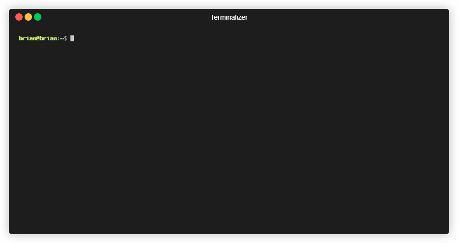

# Swoof

Just swoof it in. Ultra fast MySQL table importer. But not too fast.



This still uses MySQL commands to do the importing, so it wont be as quick as, say, the Percona xtra-backup tool, but because it uses queries, this will work across a broad range of MySQL versions.

Also, `swoof` doesn't import tables over top of existing tables like `mysqldump` does, but instead writes to a temp table, and once completed, drops and renames the temp table to match the original, so long imports don't interfere with working on your dev system.

---

## Dependencies

You will need Golang, which you can get from here https://golang.org/doc/install.

## Installing

All you need to download, build, and install is the following command (including the dots, Go's neat!)
```shell
go get github.com/StirlingMarketingGroup/swoof/...
```

If you already have `$GOPATH/bin` in your path, this should be all you need! If you don't though, you can add this to to your `~/.bashrc` or `~/.zshrc` or whatever file your shell runs on login.

```shell
export GOPATH=$HOME/go # if you don't already have a GOPATH set
export PATH=$PATH:$GOPATH/bin
```

## Usage

```shell
swoof [flags] 'user:pass@(host)/dbname' 'user:pass@(host)/dbname' table1 table2 table3
# or, with a connections file
swoof [flags] production localhost table1 table2 table3
```
### Flags:

  - `-c` your connections file (default `~/.config/swoof/connections.yaml` on Linux, more info below)
  - `-a` your alises file (default `~/.config/swoof/aliases.yaml` on Linux, more info below)
  - `-disable-tx` disables transactions for inserts, this will dramatically slow down imports
  - `-n` drop/create tables and triggers only, without importing data
  - `-p` prefix of the temp table used for initial creation before the swap and drop (default `_swoof_`)
  - `-r` value
        max rows buffer size. Will have this many rows downloaded and ready for importing, or in Go terms, the channel size used to communicate the rows (default 50)
  - `-t` value
        max concurrent tables at the same time. Anything more than 4 seems to crash things, so YMMV (default 4)

### Using a connections file

You can use a `connections.yaml` file that looks like this to describe preset connections for easier use

```yaml
production:
  user: root
  pass: super secret password
  host: my-live.db:3307
  schema: cooldb
  source_only: true
localhost:
  user: root
  pass: correct horse battery staple
  host: 127.0.0.1
  schema: cooldb
  dest_only: true
  params:
    maxAllowedPacket: 1048576
```

You can also set `source_only` and `dest_only` per connection to make sure that accidental use of a source connection, like a production server, doesn't get written to by mistake.

This file is located using Golangs `os.UserConfigDir()`.

> On Unix systems, it returns $XDG_CONFIG_HOME as specified by <https://specifications.freedesktop.org/basedir-spec/basedir-spec-latest.html> if non-empty, else $HOME/.config. On Darwin, it returns $HOME/Library/Application Support. On Windows, it returns %AppData%. On Plan 9, it returns $home/lib.

If you run `swoof` with no arguments, it will list the default on your system under the flag descriptions. You can specify your own location with the `-c` flag.

### Using an aliases files

You can use a `aliases.yaml` file that looks like this to describe sets of tables

```yaml
Products:
  - products
  - productlines
Orders:
  - orders
  - orderdetails
  - products
  - productlines
  - customers
  - payments
All:
  - Products
  - Orders
```

the cli works just as usual. The program checks if the key passed is one of the keys in the aliases file and then checks if its a table. So make sure that your aliases do not match your table names!

Also, Aliases can use other aliases which resolve until all of the aliases become just the table names.

### DSN (Data Source Name)

Source and destination strings can also be DSNs. The Data Source Name has a common format, like e.g. [PEAR DB](http://pear.php.net/manual/en/package.database.db.intro-dsn.php) uses it, but without type-prefix (optional parts marked by squared brackets):
```
[username[:password]@][protocol[(address)]]/dbname[?param1=value1&...&paramN=valueN]
```

A DSN in its fullest form:
```
username:password@protocol(address)/dbname?param=value
```

Except for the databasename, all values are optional. So the minimal DSN is:
```
/dbname
```

If you do not want to preselect a database, leave `dbname` empty:
```
/
```
This has the same effect as an empty DSN string:
```
```

Using the DSN you can also tweak the packet size that's used. If you're running into deadlock issues or other issues, you can try to tune the packet size down by setting the packet size in the DSN like so.

##### `maxAllowedPacket`
```
Type:          decimal number
Default:       4194304
```

Max packet size allowed in bytes. The default value is 4 MiB and should be adjusted to match the server settings. `maxAllowedPacket=0` can be used to automatically fetch the `max_allowed_packet` variable from server *on every connection*.

You can read more about DSNs here https://github.com/go-sql-driver/mysql#dsn-data-source-name.

### Limitations

It's possible that you'll get the following error when importing a rather large table

```
panic: Error 1180: Got error 5 - 'Transaction size exceed set threshold' during COMMIT
```

To get around this, you can either increase your `innodb_log_file_size` in your MySQL server config to something like `256MB`, or you can use the command line flag `-disable-tx` to disable the use of transactions. This will make the copy go *much* slower, but slower is better than not working at all. Read more here [mysql innodb max size of transaction](https://stackoverflow.com/a/2724139/728236).